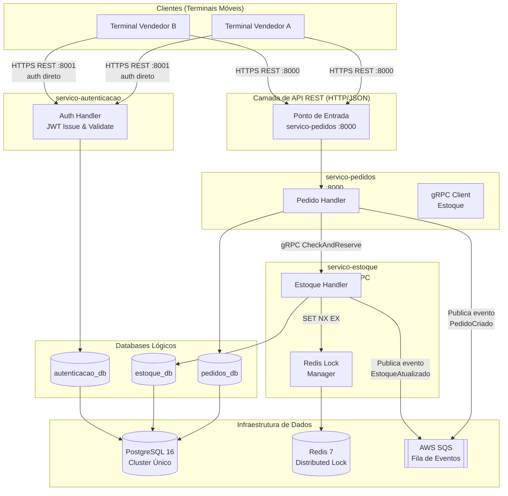

# Documento de Definição e Planejamento da Arquitetura

> **Projeto:** CaixaNaMao  
> **Sprint:** 1  
> **Autor:** c4rlosfb  
> **Status:** Aprovado  
> **Última atualização:** 2026-09-18

---

## 1. Visão Geral

O **CaixaNaMao** é uma plataforma distribuída para auxiliar vendedores ambulantes no
gerenciamento de estoque e processamento de pedidos em tempo real. Terminais móveis de
múltiplos vendedores se comunicam com o sistema de forma concorrente; a arquitetura
deve garantir que dois vendedores nunca consigam confirmar a venda do mesmo item esgotado.

### Requisitos Não-Funcionais Determinantes

| Requisito | Meta |
|---|---|
| Consistência de estoque | Forte (sem venda dupla de item único) |
| Disponibilidade | Alta — tolerância a falha parcial de um serviço |
| Latência interna (serviço → serviço) | < 50 ms (gRPC) |
| Latência da API externa | < 200 ms (p95) |
| Escalabilidade | Horizontal por microsserviço independente |

---

## 2. Diagrama de Componentes



---

## 3. Microsserviços

### 3.1 servico-autenticacao

| Atributo | Detalhe |
|---|---|
| **Linguagem** | Python 3.12 |
| **Framework** | FastAPI |
| **Porta** | 8001 (HTTP) |
| **Banco** | `autenticacao_db` (PostgreSQL) |
| **Responsabilidade** | Cadastro de usuários, emissão e validação de tokens JWT |

**Endpoints principais:**

```
POST /auth/register   → cadastra novo vendedor
POST /auth/login      → autentica e devolve JWT (access + refresh token)
POST /auth/refresh    → renova access token via refresh token
POST /auth/validate   → introspecção/revogação de token (uso futuro — Sprint 4+; validação no caminho crítico é local via HS256)
```

**Modelo de dados (`autenticacao_db`):**

```
usuarios (id UUID PK, nome TEXT, email TEXT UNIQUE, senha_hash TEXT,
          criado_em TIMESTAMPTZ, ativo BOOLEAN)
refresh_tokens (id UUID PK, usuario_id UUID FK, token_hash TEXT UNIQUE,
                expira_em TIMESTAMPTZ, revogado BOOLEAN)
```

---

### 3.2 servico-pedidos

| Atributo | Detalhe |
|---|---|
| **Linguagem** | Python 3.12 |
| **Framework** | FastAPI |
| **Porta** | 8000 (HTTP) — ponto de entrada externo |
| **Banco** | `pedidos_db` (PostgreSQL) |
| **Responsabilidade** | Criação, consulta e atualização de pedidos; coordena reserva de estoque via gRPC |

**Endpoints principais:**

```
POST   /pedidos            → cria pedido (dispara reserva de estoque)
GET    /pedidos/{id}       → consulta pedido por ID
GET    /pedidos?vendedor=  → lista pedidos de um vendedor
PATCH  /pedidos/{id}/cancelar → cancela pedido (libera estoque)
```

**Fluxo de criação de pedido (happy path):**

```
1. Recebe requisição REST com JWT do terminal
2. Valida JWT **localmente** (HS256 com segredo compartilhado via variável de ambiente) — sem chamada de rede ao servico-autenticacao no caminho crítico
3. Chama servico-estoque via gRPC: CheckAndReserve(item_id, quantidade)
4. Se reserva OK → persiste pedido com status CONFIRMADO em pedidos_db
5. Publica evento PedidoCriado na fila SQS
6. Retorna 201 com o pedido criado
```

**Modelo de dados (`pedidos_db`):**

```
pedidos (id UUID PK, vendedor_id UUID, status TEXT, total NUMERIC,
         criado_em TIMESTAMPTZ, atualizado_em TIMESTAMPTZ)
itens_pedido (id UUID PK, pedido_id UUID FK, item_id UUID,
              quantidade INT, preco_unitario NUMERIC)
```

---

### 3.3 servico-estoque

| Atributo | Detalhe |
|---|---|
| **Linguagem** | Python 3.12 |
| **Framework** | gRPC (grpcio) + FastAPI para health check |
| **Porta** | 50051 (gRPC) / 8002 (HTTP health) |
| **Banco** | `estoque_db` (PostgreSQL) |
| **Lock** | Redis 7 (`SET NX EX` — lock atômico com TTL) |
| **Responsabilidade** | Gerenciar inventário com garantia de exclusão mútua na reserva |

**Procedimentos gRPC (contrato em `shared-protos/estoque.proto`):**

```protobuf
service EstoqueService {
  rpc CheckAndReserve (ReservaRequest)  returns (ReservaResponse);
  rpc ReleaseReserva  (ReleaseRequest)  returns (ReleaseResponse);
  rpc ConsultarItem   (ItemRequest)     returns (ItemResponse);
}
```

**Fluxo de reserva com exclusão mútua:**

```
1. Recebe CheckAndReserve(item_id, quantidade, pedido_id, request_uuid)
   — pedido_id gerado pelo servico-pedidos antes da chamada gRPC (ver contrato em shared-protos/estoque.proto)
2. Tenta adquirir Redis Lock (atômico): SET lock:estoque:{item_id} {request_uuid} NX EX 5
3. Se lock não adquirido → retorna ESTOQUE_BLOQUEADO (cliente faz retry)
4. Dentro do lock:
   a. Lê quantidade_disponivel em estoque_db (SELECT FOR UPDATE para consistência)
   b. Se disponivel >= quantidade:
      - quantidade_disponivel -= quantidade
      - quantidade_reservada += quantidade
      - Insere linha em movimentacoes (tipo='RESERVA', pedido_id, quantidade)
      - Persiste atomicamente em transação PostgreSQL
   c. Se insuficiente → retorna ESTOQUE_INSUFICIENTE
5. Libera lock via Lua (atômico — verifica ownership antes de DEL):
   if redis.call('GET', KEYS[1]) == ARGV[1] then
     return redis.call('DEL', KEYS[1])
   end
6. Retorna resultado
```

**Modelo de dados (`estoque_db`):**

```
itens (id UUID PK, nome TEXT, descricao TEXT, preco NUMERIC,
       quantidade_disponivel INT, quantidade_reservada INT,
       atualizado_em TIMESTAMPTZ)
movimentacoes (id UUID PK, item_id UUID FK, tipo TEXT,
               quantidade INT, pedido_id UUID, criado_em TIMESTAMPTZ)
```

---

## 4. Comunicação entre Serviços

### 4.1 REST (externa — clientes → sistema)

- Protocolo: HTTP/1.1 + JSON
- Autenticação: Bearer JWT no header `Authorization`
- Rotas de autenticação (registro, login, refresh) são acessadas diretamente em `servico-autenticacao` (porta 8001)
- Rotas de negócio (pedidos) são acessadas em `servico-pedidos` (porta 8000)
- O `servico-pedidos` **valida o JWT localmente** (HS256 com segredo compartilhado via variável de ambiente) — sem chamada de rede ao `servico-autenticacao` no caminho crítico

> **Nota:** Não existe API Gateway até a Sprint 4 (#15). Até lá, os terminais conectam-se diretamente às portas 8000 e 8001.

### 4.2 gRPC (interna — serviço → serviço)

- Protocolo: HTTP/2 + Protocol Buffers (binário)
- Adotado para a chamada crítica `Pedidos → Estoque` por latência e tipagem forte
- Contratos centralizados em `/shared-protos/*.proto`
- Geração de stubs: `python -m grpc_tools.protoc` no pipeline de build de cada serviço

### 4.3 Mensageria Assíncrona — AWS SQS

- Usada para eventos não-críticos que não precisam de resposta síncrona
- Filas previstas:

| Fila | Produtor | Consumidor futuro |
|---|---|---|
| `caixanamao-pedidos-criados` | servico-pedidos | Notificações, Analytics |
| `caixanamao-estoque-atualizado` | servico-estoque | Relatórios, Alertas de reposição |

---

## 5. Modelo de Dados e Persistência

### 5.1 PostgreSQL — Cluster Único, Databases Lógicos Isolados

Um único servidor PostgreSQL 16 hospeda três databases lógicos independentes.
Cada microsserviço conecta-se **somente ao seu próprio database** via string de conexão dedicada e usuário com permissões restritas (GRANT mínimo).

```
postgresql://
  pedidos_user:***@postgres:5432/pedidos_db       → servico-pedidos
  estoque_user:***@postgres:5432/estoque_db       → servico-estoque
  auth_user:***@postgres:5432/autenticacao_db     → servico-autenticacao
```

Essa abordagem:
- Mantém **isolamento lógico** exigido pelo padrão de microsserviços
- Poupa a configuração de 3 servidores distintos (Sprint 1)
- Facilita a **replicação física futura** do cluster único (Sprint 3+)

### 5.2 Redis 7 — Distributed Lock

Usado exclusivamente como mecanismo de exclusão mútua transiente.
**Não é banco de dados persistente** — dados de negócio não são armazenados no Redis.

---

## 6. Estratégia de Autenticação

```
Terminal                servico-pedidos           servico-autenticacao
   |                          |                           |
   |-- POST /auth/login ------------------------------>  |
   |<------ { access_token, refresh_token } -----------  |
   |                          |                           |
   |-- POST /pedidos (JWT) -> |                           |
   |                          | valida JWT localmente     |
   |                          | (HS256, sem chamada HTTP) |
   |                          |                           |
   |                    (processa pedido)                 |
```

- Tokens JWT com expiração curta (15 min para access, 7 dias para refresh)
- Algoritmo: **HS256** com segredo compartilhado via variável de ambiente `JWT_SECRET`
- Validação **local** no `servico-pedidos` — sem chamada de rede ao `servico-autenticacao` no caminho crítico (decisão de latência — ver ADR-001)
- `POST /auth/validate` reservado para introspecção/revogação futura (Sprint 4+)
- Stateless: nenhum estado de sessão no `servico-pedidos`

> **Nota de infraestrutura:** Não existe API Gateway até a Sprint 4 (#15). Clientes acessam diretamente `:8001` para autenticação e `:8000` para pedidos.

---

## 7. Infraestrutura e Orquestração

### 7.1 Docker

Cada microsserviço possui seu próprio `Dockerfile` (imagem Python slim).
Nenhuma dependência de runtime é compartilhada entre containers.

### 7.2 docker-compose (ambiente local / desenvolvimento)

```yaml
# Serviços de infraestrutura (já configurados):
postgres:16      → porta 5432
redis:7          → porta 6379

# Microsserviços (a configurar nas Sprints 2+):
servico-autenticacao  → porta 8001
servico-pedidos       → porta 8000
servico-estoque       → portas 8002 (HTTP) e 50051 (gRPC)
```

Variáveis sensíveis (senhas, segredos JWT) são injetadas via arquivo `.env`
**não versionado** (listado no `.gitignore`).

---

## 8. Riscos e Mitigações

| Risco | Probabilidade | Impacto | Mitigação |
|---|---|---|---|
| Lock Redis expirar antes da transação terminar | Baixa | Alto | TTL conservador (5s); monitorar latência do PostgreSQL |
| Partição de rede entre Pedidos e Estoque | Média | Alto | Circuit Breaker (Sprint 4) + retry com backoff exponencial |
| Gargalo no único cluster PostgreSQL | Baixa (Sprint 1) | Médio | Replicação de leitura planejada para Sprint 3 |
| SQS indisponível | Baixa | Baixo | Eventos são não-críticos; sistema continua operando sem eles |
| Divergência de schema entre serviços | Média | Médio | Migrations independentes por serviço (Alembic) |

---

## 9. Glossário

| Termo | Definição |
|---|---|
| **gRPC** | Framework RPC de alta performance usando HTTP/2 e Protocol Buffers |
| **JWT** | JSON Web Token — padrão para tokens de autenticação stateless |
| **Redis Lock** | Mecanismo de exclusão mútua distribuída usando comandos atômicos do Redis |
| **SQS** | Amazon Simple Queue Service — fila de mensagens gerenciada |
| **ADR** | Architecture Decision Record — registro formal de uma decisão arquitetural |
| **Circuit Breaker** | Padrão que interrompe chamadas a um serviço instável para evitar falhas em cascata |
