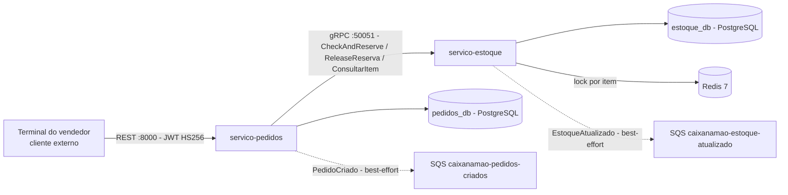
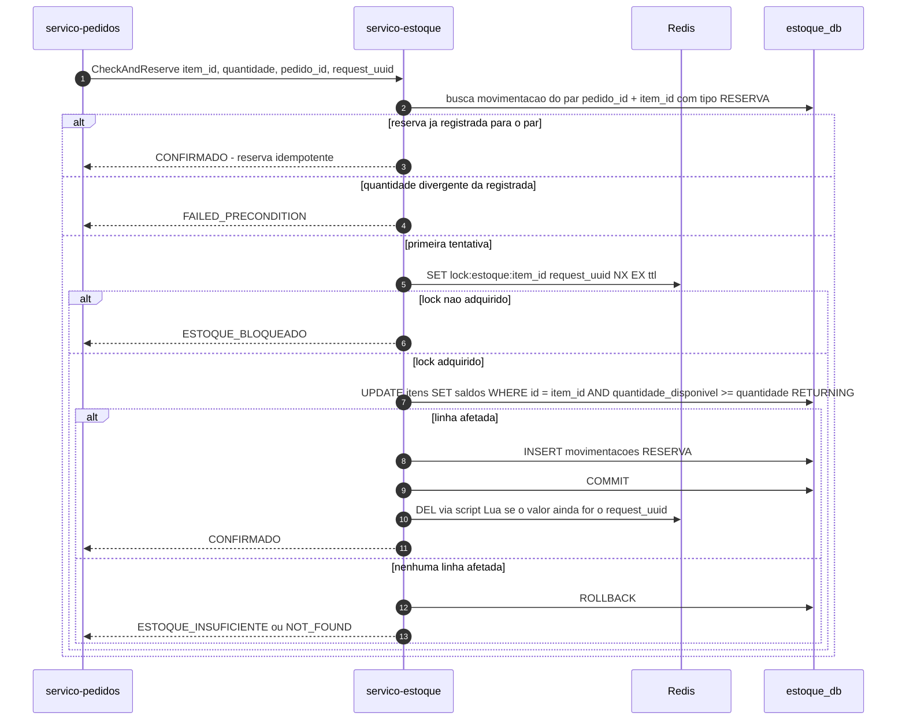
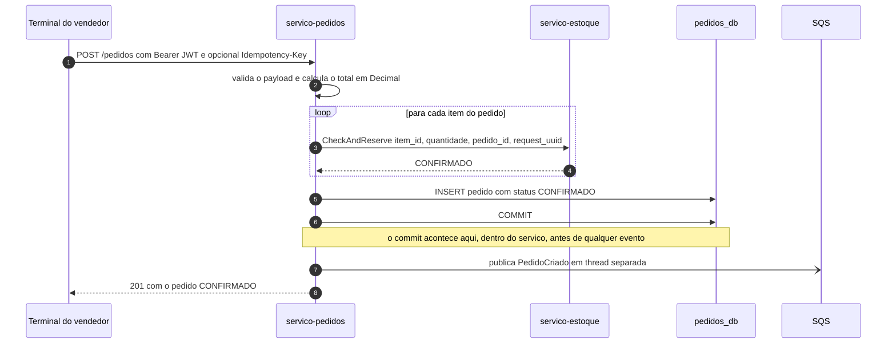
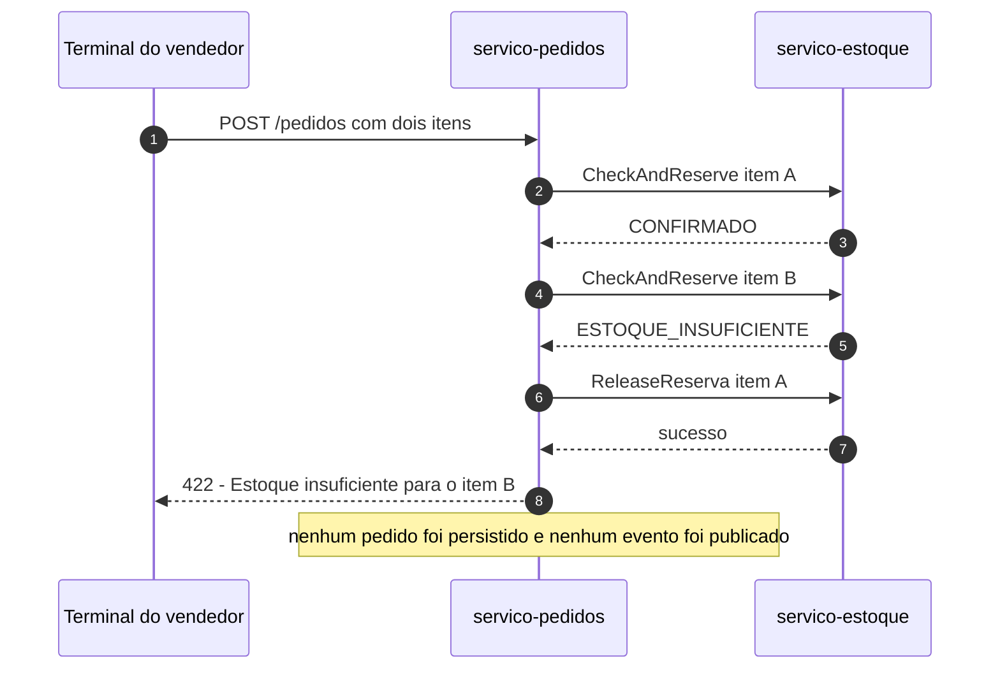
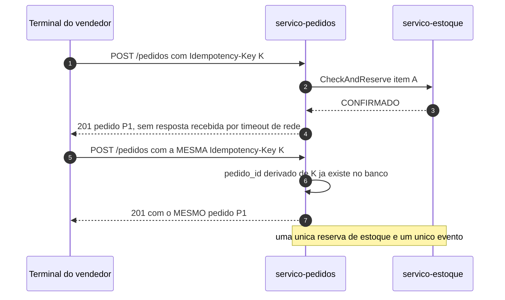
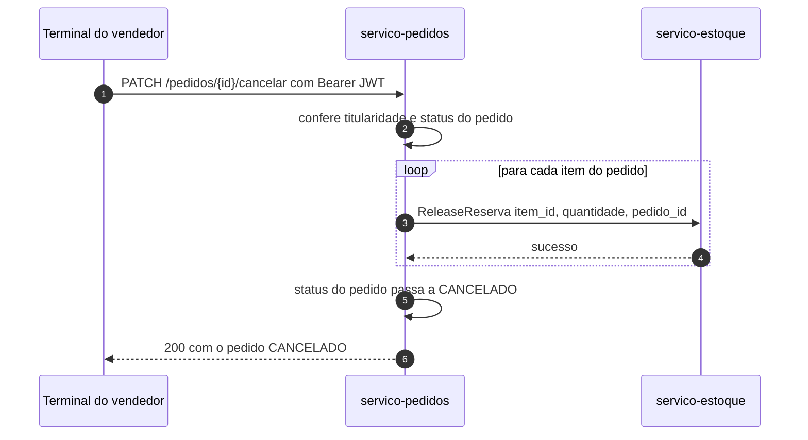

# Documentação Técnica — Comunicações REST e gRPC

> **Projeto:** CaixaNaMao
> **Sprint:** 2
> **Issue:** #9 — [Issue 8] Documentar implementacao das comunicacoes REST e gRPC
> **Autor:** EduardoTenorioNunes (Eduardo Tenório Nunes)
> **Status:** Em revisão
> **Última atualização:** 2026-09-22

Documenta a implementação das duas comunicações síncronas da Sprint 2: a **API REST** do
`servico-pedidos`, voltada aos terminais dos vendedores, e a **chamada gRPC** interna entre o
`servico-pedidos` e o `servico-estoque`. O documento descreve o que está implementado em `dev` —
não o que se planeja implementar — e aponta as decisões de arquitetura que sustentam cada trecho
(`docs/arquitetura.md` e `docs/decisoes-tecnicas.md`).

---

## 1. Panorama das comunicações

| Caminho | Protocolo | Porta | Autenticação | Caráter |
|---|---|---|---|---|
| Terminal do vendedor → `servico-pedidos` | REST / HTTP 1.1 + JSON | 8000 | Bearer JWT HS256 validado localmente | Síncrono, caminho crítico |
| `servico-pedidos` → `servico-estoque` | gRPC / HTTP 2 + Protobuf | 50051 | Rede interna do compose, sem autenticação serviço-a-serviço | Síncrono, caminho crítico |
| `servico-estoque` → PostgreSQL + Redis | SQL / RESP | 5432 / 6379 | Usuário isolado por database / sem senha no Redis de dev | Síncrono, dentro da operação |
| `servico-pedidos` → SQS `caixanamao-pedidos-criados` | HTTPS + JSON | 4566 (LocalStack) | Credenciais AWS por variável de ambiente | Assíncrono, **best-effort** |
| `servico-estoque` → SQS `caixanamao-estoque-atualizado` | HTTPS + JSON | 4566 (LocalStack) | Credenciais AWS por variável de ambiente | Assíncrono, **best-effort** |
| Terminais de operação → health checks | REST / HTTP | 8000 e 8002 | Nenhuma | Liveness e readiness |



Duas decisões explicam o desenho:

- **ADR-001** — o JWT é validado **localmente** no `servico-pedidos` (HS256 com segredo
  compartilhado). Nenhuma chamada de rede ao `servico-autenticacao` entra no caminho crítico da
  criação de pedido; o `sub` do token é o `vendedor_id` usado em toda a autorização.
- **ADR-005** — a mensageria é assíncrona e **best-effort**: falha de publicação é registrada em
  log e não altera a resposta ao cliente, porque o pedido já está confirmado no banco quando o
  evento é agendado.

---

## 2. REST — `servico-pedidos` porta 8000

A API é o ponto de entrada externo do sistema. O router está em
`servico-pedidos/app/routers/pedidos.py`; as regras de negócio ficam em
`servico-pedidos/app/services/pedido_service.py` e o acesso a dados em
`servico-pedidos/app/repositories/pedido_repository.py`.

### 2.1 Autenticação e autorização

| Situação | Resposta |
|---|---|
| Sem header `Authorization` | `403` — o `HTTPBearer(auto_error=True)` recusa a requisição antes do handler |
| Token malformado, com assinatura inválida ou `sub` não-UUID | `401` — `Token inválido: ...` |
| Token expirado | `401` — `Token expirado` |
| Token válido de outro vendedor acessando um pedido alheio | `403` — `Sem permissão` |

O `vendedor_id` vem exclusivamente do token (`app/auth/jwt.py`). Nenhum endpoint aceita
`vendedor_id` por parâmetro de query ou de corpo: o isolamento entre vendedores é garantido pela
origem do dado, não por filtro opcional do cliente.

### 2.2 Endpoints

| Método | Rota | Corpo | Sucesso | Erros previstos |
|---|---|---|---|---|
| `POST` | `/pedidos` | `{ "itens": [ { "item_id": UUID, "quantidade": int > 0, "preco_unitario": decimal 2 casas } ] }` + header opcional `Idempotency-Key` | `201` com o pedido `CONFIRMADO` | `401`, `403`, `409`, `422`, `502`, `503` |
| `GET` | `/pedidos/{pedido_id}` | — | `200` com o pedido | `401`, `403`, `404` |
| `GET` | `/pedidos?limit=&offset=` | — | `200` com `{ total, items }` | `401`, `403` |
| `PATCH` | `/pedidos/{pedido_id}/cancelar` | — | `200` com o pedido `CANCELADO` | `401`, `403`, `404`, `409` |
| `GET` | `/health` | — | `200` com `{ "status": "ok" }` | — |

Regras de validação aplicadas na entrada, em `app/schemas/pedido.py`:

- o pedido tem no mínimo 1 e no máximo 100 itens;
- `quantidade > 0` e `preco_unitario > 0` com no máximo 12 dígitos e 2 casas decimais — o mesmo
  limite da coluna `NUMERIC(12,2)`;
- itens repetidos no mesmo payload são rejeitados;
- a soma dos itens é conferida contra `9999999999.99` antes de qualquer efeito
  (`_validar_total`), para que um total grande demais seja `422` e não um erro de banco.

Paginação: `limit` entre 1 e 100 (padrão 20) e `offset` a partir de 0. A listagem vem ordenada por
`criado_em` decrescente e é sempre filtrada pelo vendedor do token.

### 2.3 Idempotência do `POST /pedidos`

O header opcional `Idempotency-Key` resolve o retry do terminal: quando o cliente reenvia a mesma
chave — situação comum depois de um timeout de rede — ele recebe **o mesmo pedido**, sem nova
reserva de estoque e sem publicação de um segundo evento.

```text
pedido_id = uuid5(NAMESPACE_URL, "caixanamao/pedidos/" + Idempotency-Key)
```

O `pedido_id` determinístico é o ponto que liga a idempotência das duas pontas: como o
`servico-estoque` deduplica a reserva pelo par `(pedido_id, item_id)`, o reenvio não reserva de
novo nem do lado do pedido nem do lado do estoque. Sem o header, o `pedido_id` é um `uuid4`.

Duas respostas possíveis para a chave reapresentada: `201` com o pedido original quando o mesmo
vendedor já a usou, e `409` quando a chave pertence a outro vendedor. A segunda protege contra
colisão entre vendedores — o efeito colateral é que a chave é um namespace global por enquanto
(ver §7).

### 2.4 Códigos de erro e de onde vêm

| Código | Situação | Origem |
|---|---|---|
| `401` | Token inválido, expirado, ou sem `sub` utilizável como UUID | `app/auth/jwt.py` |
| `403` | Sem header `Authorization`, ou pedido pertencente a outro vendedor | `HTTPBearer` / `PedidoService` |
| `404` | Pedido inexistente | `PedidoService.buscar_pedido`, `cancelar_pedido` |
| `409` | Pedido já cancelado, ou `Idempotency-Key` já usada por outro vendedor | `PedidoService` |
| `422` | Payload inválido, estoque insuficiente para um item, total acima do limite da coluna | Pydantic / tradução do status `ESTOQUE_INSUFICIENTE` |
| `502` | Erro de comunicação com o `servico-estoque` — status desconhecido ou RPC falho | tradução do status `ERRO` do cliente gRPC |
| `503` | Item bloqueado por outra operação, locking indisponível, ou falha ao persistir o pedido | tradução de `ESTOQUE_BLOQUEADO` / falha de banco |

O `503` de item bloqueado acompanha o header `Retry-After: 1`, porque nesse caso a operação é
temporária: a recomendação é repetir. O `503` de falha de persistência informa que o estoque foi
liberado antes de responder.

---

## 3. gRPC — `servico-pedidos` ↔ `servico-estoque` porta 50051

O contrato é `shared-protos/estoque.proto` — fonte da verdade das duas pontas. O `servico-estoque`
implementa o serviço com `grpc.aio` (`app/grpc_server/servicer.py`) e o `servico-pedidos` consome
com um cliente dedicado (`app/clients/estoque_client.py`).

### 3.1 Contrato

```protobuf
service EstoqueService {
  rpc CheckAndReserve (ReservaRequest)  returns (ReservaResponse);
  rpc ReleaseReserva  (ReleaseRequest)  returns (ReleaseResponse);
  rpc ConsultarItem   (ItemRequest)     returns (ItemResponse);
}
```

| Mensagem | Campos |
|---|---|
| `ReservaRequest` | `item_id` (1, string), `quantidade` (2, int32), `pedido_id` (3, string), `request_uuid` (4, string) |
| `ReservaResponse` | `sucesso` (1, bool), `status` (2, string), `mensagem` (3, string) |
| `ReleaseRequest` | `item_id` (1, string), `quantidade` (2, int32), `pedido_id` (3, string) |
| `ReleaseResponse` | `sucesso` (1, bool), `mensagem` (2, string) |
| `ItemRequest` | `item_id` (1, string) |
| `ItemResponse` | `item_id` (1), `nome` (2), `quantidade_disponivel` (3), `quantidade_reservada` (4) |

Todas as RPCs são **unárias**. Os números de campo acima são verificados automaticamente por
`tests/integracao/test_contrato_estoque.py`: renumerar um campo não quebra a compilação do proto,
mas quebra a compatibilidade de fio com qualquer cliente já implantado, e agora quebra o teste.

Os stubs (`estoque_pb2.py`, `estoque_pb2_grpc.py`) são artefatos de build, nunca versionados: são
gerados pelos Dockerfiles de cada serviço, por `scripts/gerar_stubs.sh` em desenvolvimento e pela
própria suíte de integração em tempo de execução.

### 3.2 Status do contrato e tradução para HTTP

`ReservaResponse.status` carrega os três estados previstos na especificação. O cliente do
`servico-pedidos` os traduz para a resposta REST do terminal (`app/services/pedido_service.py`):

| `status` na resposta gRPC | `sucesso` | Significado | Resposta ao terminal |
|---|---|---|---|
| `CONFIRMADO` | `true` | item reservado, ou reserva já registrada para este pedido/item | segue o fluxo — `201` |
| `ESTOQUE_INSUFICIENTE` | `false` | saldo disponível menor que o solicitado | `422` — `Estoque insuficiente para o item ...` |
| `ESTOQUE_BLOQUEADO` | `false` | item em operação por outro pedido, ou locking indisponível | `503` com `Retry-After: 1` |

Situações que não cabem em `ReservaResponse` são devolvidas como erro de RPC e traduzidas no
cliente:

| Erro gRPC | Quando | Efeito no `servico-pedidos` |
|---|---|---|
| `NOT_FOUND` | `item_id` não existe em `estoque_db` | `502` |
| `INVALID_ARGUMENT` | `quantidade` menor ou igual a zero, ou UUID malformado | `502` |
| `FAILED_PRECONDITION` | retry do mesmo item com quantidade diferente da reserva registrada | `502` |
| `RESOURCE_EXHAUSTED` | mais de `GRPC_MAX_CONCURRENT_RPCS` chamadas simultâneas | `502` |

`CheckAndReserve` é chamado **uma vez por item**, sempre com o mesmo `pedido_id` e com um
`request_uuid` novo por chamada — o `request_uuid` é o token do lock, não a chave de idempotência.

### 3.3 Timeouts, repetição e backpressure

- Cada RPC tem deadline de **5 segundos** no cliente. O servidor não mantém a chamada além disso.
- A resposta `ESTOQUE_BLOQUEADO` é o mecanismo de repetição previsto na arquitetura: o cliente
  recebe `503` com `Retry-After: 1` e repete a operação.
- O servidor gRPC limita a concorrência a **100 RPCs simultâneas**
  (`GRPC_MAX_CONCURRENT_RPCS`) e responde `RESOURCE_EXHAUSTED` acima disso, em vez de acumular
  chamadas sem limite. A concorrência de banco é limitada pelo pool do SQLAlchemy.

### 3.4 Garantias do `servico-estoque`

A ordem das operações dentro de `CheckAndReserve` está em `app/services/estoque_service.py`:



Quatro pontos sustentam a consistência:

1. **Idempotência por item** — a chave é `(pedido_id, item_id, tipo)`, reforçada por
   `UNIQUE (pedido_id, item_id, tipo)` em `movimentacoes`. O retry do mesmo item não debita duas
   vezes; um pedido com vários itens registra uma reserva por item.
2. **Exclusão mútua com Redis** (ADR-004) — `SET lock:estoque:{item_id} {request_uuid} NX EX 5`,
   liberado por script Lua que só apaga a chave se o valor ainda for o `request_uuid` daquele
   chamador. TTL e prefixo são configuráveis (`LOCK_TTL_SECONDS`).
3. **A garantia de não vender o último item é do banco** — o débito é um `UPDATE` condicional
   (`WHERE quantidade_disponivel >= :quantidade`) com `RETURNING`, com `CHECK (quantidade >= 0)`
   como defesa em profundidade. O Redis é otimização de contenção: mesmo que o lock expire durante
   a operação, duas transações concorrentes não conseguem debitar o mesmo saldo.
4. **Fail closed** — se o Redis não responde, a reserva é recusada com `ESTOQUE_BLOQUEADO` sem
   tocar no banco. Nunca há degradação para "reservar sem lock", que é justamente o cenário de
   venda dupla entre instâncias.

A liberação (`ReleaseReserva`) percorre o caminho espelhado: valida a reserva registrada, aplica o
`UPDATE` condicional sobre `quantidade_reservada`, grava a movimentação `LIBERACAO` e é
**idempotente** — liberar duas vezes responde `sucesso = true` na segunda vez com a mensagem de que
a liberação já havia sido aplicada, sem devolver o estoque duas vezes. Liberar quantidade diferente
da reserva é recusado sem alterar saldo.

### 3.5 Compensação distribuída

Como a reserva é feita item a item, o `servico-pedidos` é responsável por desfazer o que já
reservou quando algo falha no meio do caminho:

| Momento da falha | Ação |
|---|---|
| Um item posterior não tem estoque, ou o estoque responde com erro | `ReleaseReserva` para todos os itens já reservados naquela requisição; nenhum pedido é persistido; resposta `422` ou `502` |
| Reserva concluída, falha ao persistir o pedido | `rollback` da transação, `ReleaseReserva` para todos os itens reservados, resposta `503` sem publicação de evento |
| Cancelamento (`PATCH`) | `ReleaseReserva` por item antes de marcar o pedido como `CANCELADO` |

A compensação é best-effort **com visibilidade**: cada liberação é isolada — a falha de um item não
impede os demais — e uma recusa do estoque gera log de erro com `pedido_id` e `item_id`, porque
estoque reservado para um pedido inexistente é o pior estado possível e precisa ser rastreável.

---

## 4. Fluxos ponta a ponta

### 4.1 Criação de pedido — caminho feliz



A ordem é deliberada: commit antes da publicação do evento. Publicar antes abriria a janela em que
um consumidor recebe `PedidoCriado` de um pedido que não existe no banco, caso o commit falhasse.
A publicação é agendada em thread própria e não é aguardada — o `POST` responde com a latência do
banco e do gRPC, não com a do broker.

### 4.2 Compensação quando um item não tem estoque



### 4.3 Retry do terminal com a mesma `Idempotency-Key`



### 4.4 Cancelamento



Se um pedido já cancelado for cancelado de novo, a resposta é `409` — o estado é terminal. Quando a
liberação de um item falha, o cancelamento continua e a falha é registrada em log: o vendedor não
fica impedido de cancelar por indisponibilidade momentânea do estoque, mas a divergência fica
rastreável.

---

## 5. Eventos assíncronos (SQS)

As duas filas são Standard, com entrega *at-least-once* — todo evento carrega um `event_id` para o
consumidor deduplicar. A publicação é sempre best-effort: falha é registrada em log e nunca altera
a resposta do comando que a originou, e o envio é agendado fora do caminho crítico.

**`caixanamao-pedidos-criados`** — publicado pelo `servico-pedidos` depois do commit:

```json
{
  "event_id": "5f1c...",
  "event_type": "PedidoCriado",
  "timestamp": "2026-09-22T12:00:00+00:00",
  "payload": {
    "pedido_id": "...",
    "vendedor_id": "...",
    "total": "32.00",
    "itens": [ { "item_id": "...", "quantidade": 2, "preco_unitario": "5.50" } ]
  }
}
```

**`caixanamao-estoque-atualizado`** — publicado pelo `servico-estoque` depois do commit da
movimentação:

```json
{
  "event_id": "9ab3...",
  "evento": "EstoqueAtualizado",
  "tipo_movimentacao": "RESERVA",
  "item_id": "...",
  "pedido_id": "...",
  "quantidade": 2,
  "quantidade_disponivel": 8,
  "quantidade_reservada": 2,
  "ocorrido_em": "2026-09-22T12:00:00+00:00"
}
```

O consumo desses eventos é de outra issue — o `servico-pedidos` e o `servico-estoque` apenas
publicam.

---

## 6. Como validar

| Verificação | Comando | O que cobre |
|---|---|---|
| Integração ponta a ponta | `bash scripts/validar_integracao.sh` | sobe a stack e roda `tests/integracao`: 19 cenários entre REST, gRPC e o efeito no PostgreSQL |
| Contrato gRPC | `pytest tests/integracao/test_contrato_estoque.py` | serviço, RPCs unárias e nome/número/tipo de cada campo do `.proto` |
| `servico-pedidos` | `cd servico-pedidos && pytest` | endpoints, autenticação, idempotência, compensação e publicação |
| `servico-estoque` | `cd servico-estoque && pytest` | domínio, lock com Lua, health e o contrato servido pelo servidor real |
| Concorrência real | `cd servico-estoque && TEST_DATABASE_URL=... pytest -m postgres` | 20 reservas concorrentes sobre estoque unitário, retries do mesmo item e fail closed |
| Lint | `ruff check .` | regras fixadas em `pyproject.toml` |

Detalhe de ambiente: a suíte de integração se **auto-pula** com o motivo quando a stack não está no
ar; o script `validar_integracao.sh` é o caminho que sobe a stack e falha se ela não ficar pronta,
para que a validação não vire um verde vazio.

---

## 7. Limitações conhecidas e próximos passos

| Ponto | Estado atual | Próximo passo sugerido |
|---|---|---|
| Escopo da `Idempotency-Key` | a chave é global: dois vendedores usando a mesma string colidem e o segundo recebe `409` | derivar o `pedido_id` de `vendedor_id + chave` |
| Chave reapresentada com payload diferente | devolve `201` com o pedido original, sem sinalizar a divergência | documentar no contrato do endpoint ou responder `409` |
| `RESOURCE_EXHAUSTED` do gRPC | chega ao terminal como `502` | tratar como erro repetível, `503` com `Retry-After` |
| Autenticação serviço-a-serviço | não existe: o gRPC confia na rede interna | está na matriz de riscos; avaliar mTLS ou token interno |
| Consumo dos eventos | nenhum consumidor implementado | issue #19 — Serviço de Notificações |

---

## 8. Referências

- `shared-protos/estoque.proto` — contrato gRPC entre pedidos e estoque.
- `docs/arquitetura.md` §3.2, §3.3, §4 e §6 — endpoints, fluxo de reserva, comunicação e autenticação.
- `docs/decisoes-tecnicas.md` — ADR-001 (validação local do JWT), ADR-002, ADR-003, ADR-004 (lock
  distribuído e fail closed) e ADR-005 (SQS best-effort).
- `servico-pedidos/app/routers/pedidos.py`, `app/services/pedido_service.py`,
  `app/clients/estoque_client.py` — implementação REST, orquestração e cliente gRPC.
- `servico-estoque/app/grpc_server/servicer.py`, `app/services/estoque_service.py`,
  `app/repositories/estoque_repository.py`, `app/locking/redis_lock.py` — servidor gRPC, regras de
  reserva, escrita condicional e lock.
- `tests/integracao/README.md` — como rodar e o que a verificação de integração cobre.
- Issues relacionadas: #5 e #6 (implementação dos serviços), #7 (contrato e integração gRPC),
  #8 (deploy inicial na AWS).
